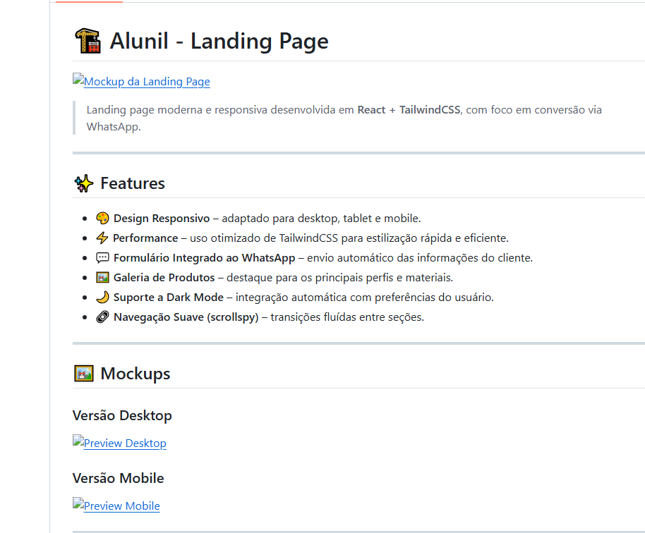
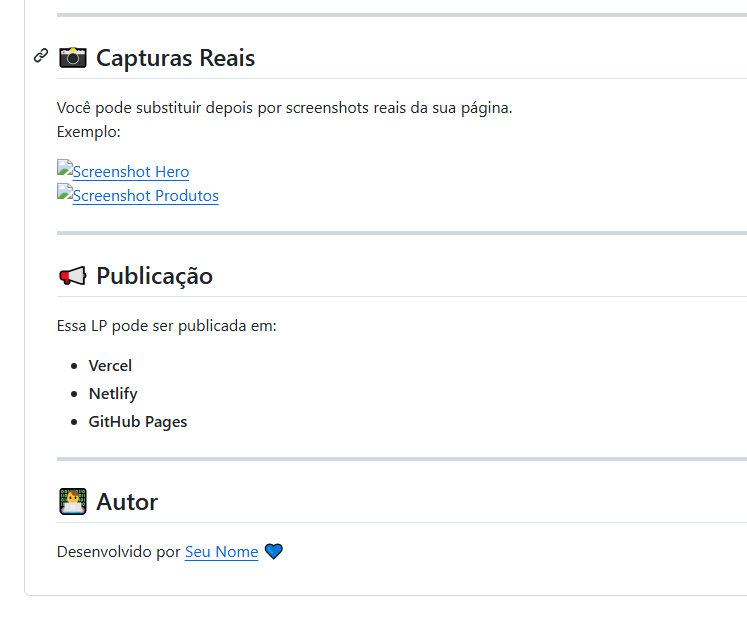

# 🏷️ Template React Sales

Landing page moderna e responsiva desenvolvida em **React + TailwindCSS**, com foco em conversão via WhatsApp.

---

## ✨ Features

- 🎨 **Design Responsivo** – adaptado para desktop, tablet e mobile.  
- ⚡ **Performance** – uso otimizado de TailwindCSS para estilização rápida e eficiente.  
- 💬 **Formulário Integrado ao WhatsApp** – envio automático das informações do cliente.  
- 🖼️ **Galeria de Produtos** – destaque para os principais perfis e materiais.  
- 🌙 **Suporte a Dark Mode** – integração automática com preferências do usuário.  
- 🧭 **Navegação Suave (scrollspy)** – transições fluídas entre seções.  

---

## 🖼️ Mockups

### Versão Desktop

### Versão Mobile

---

## 📸 Capturas Reais

Você pode substituir depois por screenshots reais da sua página.  
Exemplo:

  
  

---

## 🚀 Publicação

Essa LP pode ser publicada em:

- [Vercel](https://vercel.com)  
- [Netlify](https://www.netlify.com)  
- [GitHub Pages](https://pages.github.com)  

---

## 👨‍💻 Autor

Desenvolvido por **Luiz Gustavo** 💙
